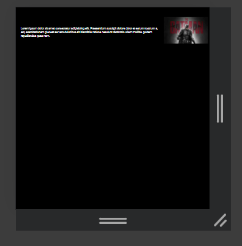

# Media Query Project

Welcome to the repository for my media query project! This project demonstrates the use of media queries in HTML and CSS to create responsive web design.

## Overview

This project showcases how media queries can be used to adjust the layout and styling of a webpage based on the characteristics of the device or browser viewport. It provides examples of responsive design techniques to ensure optimal viewing experience across various screen sizes and devices.

## Features

- Responsive layout: The project includes responsive design elements that adapt to different screen sizes, including desktops, tablets, and mobile devices.
- Media query breakpoints: Demonstrates the use of media query breakpoints to define specific styles for different screen widths or device orientations.
- Flexibility: The project illustrates how media queries can be used to make adjustments to font sizes, margins, padding, and other layout properties to optimize content presentation.

## Screenshots

## Technologies Used

- HTML
- CSS

## Getting Started

To view the project, follow these simple steps:

1. Clone the repository: `git clone https://github.com/syedmusab125/media-query-project.git`
2. Open the project directory in your preferred code editor.
3. Open `index.html` in your web browser to view the media query project.

## Usage

1. Open the project in a web browser.
2. Resize the browser window to see how the layout and styling adapt to different screen sizes.
3. Explore the code to understand how media queries are implemented to achieve responsive design.

## Contributing

Contributions are welcome! If you'd like to contribute to this project, please fork the repository and create a pull request.

